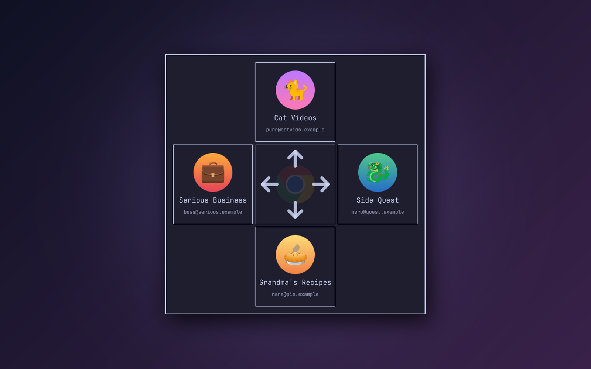

# Chrome Launcher

Pick a Chrome or Chromium profile with a single arrow key and get a new browser
window right where you are: on the workspace you're looking at, not wherever
that profile happens to have a window open already.

A plugin for the [Omarchy](https://omarchy.org) shell.


## What it does

- Press your browser key and your profiles appear in a cross around the browser icon.
- **←** opens the first profile, **→** the second, **↑** the third and **↓** the fourth.
  One key press, no Enter needed.
- The new window always opens on your **current workspace**. Chrome normally
  places it next to that profile's existing window, somewhere else, and pulls
  you along with it.
- With only one profile there's nothing to choose, so it skips the picker and
  opens a window straight away.
- It follows your default browser: Google Chrome or Chromium.
- It uses your theme's menu colours, and shows each profile's Google picture,
  name and email.

| Three profiles | Four profiles |
|---|---|
|  |  |

## Install

```bash
omarchy plugin add https://github.com/jimmibram/chrome-launcher.git --enable
```

Then give it a key. Add this to `~/.config/hypr/bindings.lua` to take over
SUPER+SHIFT+RETURN (Omarchy's default browser key):

```lua
hl.unbind("SUPER + SHIFT + RETURN")
o.bind("SUPER + SHIFT + RETURN", "Chrome Launcher", "~/.config/omarchy/plugins/jimmibram.chrome-launcher/bin/chrome-launcher")
```

Hyprland reloads the file on save, so the key works right away.

## Using it

| Key | Action |
|---|---|
| ← → ↑ ↓ | Open that profile in a new window |
| Esc, or click outside | Cancel |
| Mouse | Hover a profile to light up its arrow, click to open |

Profiles appear in the order Chrome keeps them in, so each arrow always opens
the same profile. The picker shows up to four profiles, one per arrow.

To force a browser regardless of your default, pass it as an argument:

```bash
~/.config/omarchy/plugins/jimmibram.chrome-launcher/bin/chrome-launcher chromium
~/.config/omarchy/plugins/jimmibram.chrome-launcher/bin/chrome-launcher chrome
```

## How it works

The script reads the browser's profile list from its `Local State` file and
shows the picker as an Omarchy shell overlay. When you choose a profile, it
starts the browser with `--profile-directory=… --new-window`, with a temporary
Hyprland window rule that puts the new window on your current workspace. The
rule is turned off again as soon as the window appears.

## Requirements

- Omarchy with the Lua-based Hyprland config (Hyprland 0.56 or later)
- Google Chrome (`google-chrome-stable`) or Chromium (`chromium`)

Everything else it uses (`jq`, `socat`, `python`) ships with Omarchy.

## Update and uninstall

```bash
omarchy plugin update jimmibram.chrome-launcher
omarchy plugin remove jimmibram.chrome-launcher
```

After removing it, take the two lines back out of `bindings.lua`.

## License

MIT. See [LICENSE](LICENSE).

Not affiliated with or endorsed by Google. Google Chrome is a trademark of
Google LLC. The plugin shows the browser icon that is installed on your own
system; it doesn't ship any Google artwork.
