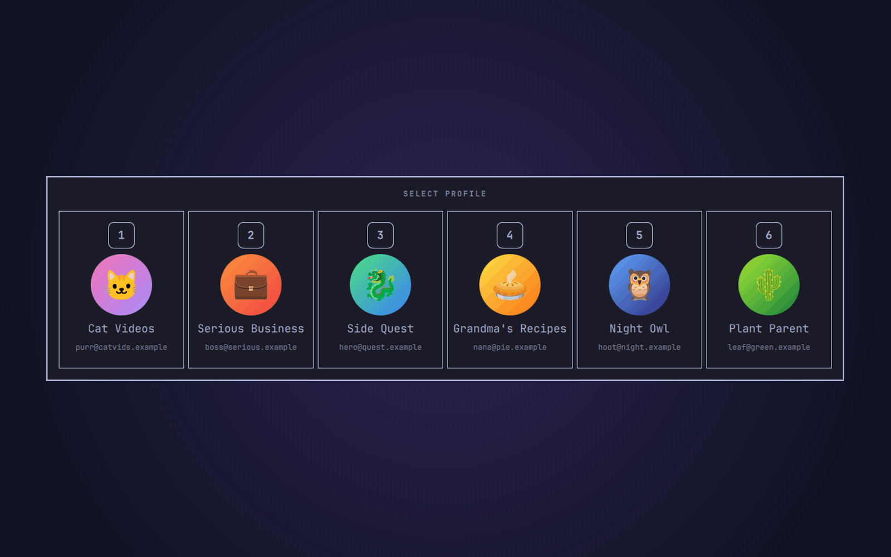

# Chrome Launcher

Pick a Chrome or Chromium profile with a single arrow key and get a new browser
window right where you are: on the workspace you're looking at, not wherever
that profile happens to have a window open already.

A plugin for the [Omarchy](https://omarchy.org) shell.


## What it does

- Press your browser key and your profiles appear in a cross, each behind its arrow key.
- **←** opens the first profile, **→** the second, **↑** the third and **↓** the fourth.
  One key press, no Enter needed.
- With five or more profiles they line up in a row instead, numbered, and the
  keys **1** to **9** open them.
- The new window always opens on your **current workspace**. Chrome normally
  places it next to that profile's existing window, somewhere else, and pulls
  you along with it.
- With only one profile there's nothing to choose, so it skips the picker and
  opens a window straight away.
- It follows your default browser: Google Chrome or Chromium.
- It uses your theme's menu colours, and shows each profile's Google picture,
  name and email.

| Three profiles | Four profiles |
|---|---|
|  |  |

With five or more, the profiles line up in a numbered row:



## Install

```bash
omarchy plugin add https://github.com/jimmibram/chrome-launcher.git --enable
```

That's it: SUPER+SHIFT+RETURN (Omarchy's browser key) now opens the picker.

The plugin takes over that key only while it is enabled, and it doesn't touch
your config files. Disable or remove it and the key goes back to Omarchy's own
browser launcher. It takes SUPER+SHIFT+RETURN whatever you have bound it to;
if that was something of your own, it returns with the next config reload.

If you're updating from 1.0 and the key hasn't switched over, restart the shell
once with `omarchy-restart-shell`. You can also delete the two lines 1.0 had
you add to `~/.config/hypr/bindings.lua`. They do no harm, but you no longer
need them.

## Using it

| Key | Action |
|---|---|
| ← → ↑ ↓ | Open that profile in a new window (up to four profiles) |
| 1 … 9 | Open that profile in a new window (five or more, shown in a row) |
| Esc, or click outside | Cancel |
| Mouse | Hover a profile to light up its arrow, click to open |

Profiles appear in the order Chrome keeps them in, so each key always opens
the same profile. The picker shows up to nine profiles.

To force a browser regardless of your default, pass it as an argument:

```bash
~/.config/omarchy/plugins/jimmibram.chrome-launcher/bin/chrome-launcher chromium
~/.config/omarchy/plugins/jimmibram.chrome-launcher/bin/chrome-launcher chrome
```

## How it works

The script reads the browser's profile list from its `Local State` file into a
private temporary directory and shows the picker as an Omarchy shell overlay.
The picker writes your choice back into that directory, which the script
watches with inotify. It then starts the browser with
`--profile-directory=… --new-window`, with a temporary Hyprland window rule that
puts the new window on your current workspace. The rule is turned off again as
soon as the window appears.

## Requirements

- Omarchy with the Lua-based Hyprland config (Hyprland 0.56 or later)
- Google Chrome (`google-chrome-stable`) or Chromium (`chromium`)

Everything else it uses (`jq`, `socat`, `inotifywait`, `python`) ships with Omarchy.

## Update and uninstall

```bash
omarchy plugin update jimmibram.chrome-launcher
omarchy plugin remove jimmibram.chrome-launcher
```

## License

MIT. See [LICENSE](LICENSE).

Not affiliated with or endorsed by Google. Google Chrome is a trademark of
Google LLC. The plugin doesn't ship any Google artwork.
